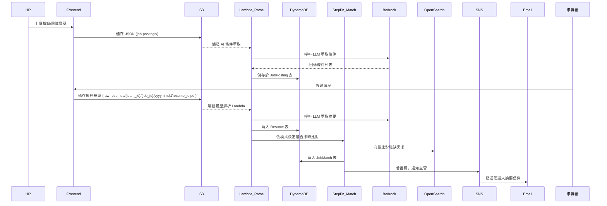

# 📊 Benson-hAIre 智能招募系統資料架構

## 🎯 系統資料流程圖

## 🧱 資料表 Schema

---

### 🗂️ JobPosting 表（DynamoDB）

主鍵：`job_id`（string）

| 欄位名                 | 資料型別  | 說明                         |
|------------------------|-----------|------------------------------|
| `job_id`               | string    | 職缺 ID，UUID 格式           |
| `team_id`              | string    | 部門/單位代碼                |
| `job_title`            | string    | 職稱                         |
| `job_description`      | string    | 原始 HR 上傳內容             |
| `extracted_requirements` | map/list | AI 萃取條件，包含技能、年資等 |
| `status`               | string    | 開啟狀態（open/closed）      |
| `created_at`           | string    | 建立時間（ISO 8601）         |

---

### 🗂️ Resume 表（DynamoDB）

主鍵：`resume_id`（string）

| 欄位名             | 資料型別 | 說明                              |
|--------------------|----------|-----------------------------------|
| `resume_id`        | string   | 履歷 ID，UUID                     |
| `candidate_name`   | string   | 求職者姓名                        |
| `email`            | string   | 聯絡信箱                          |
| `source`           | string   | 來源（104、自投等）               |
| `job_id`           | string   | 投遞目標職缺 ID                   |
| `team_id`          | string   | 投遞目標部門                      |
| `raw_resume_s3`    | string   | 履歷檔案在 S3 的完整路徑         |
| `parsed_profile`   | map      | AI 解析欄位（技能、學歷、經歷等）|
| `submitted_at`     | string   | 投遞時間（ISO 8601）              |

---

### 🗂️ JobMatch 表（DynamoDB）

複合鍵：`job_id`（PK）+ `resume_id`（SK）

| 欄位名               | 資料型別 | 說明                              |
|----------------------|----------|-----------------------------------|
| `job_id`             | string   | 職缺 ID（對應職缺）              |
| `resume_id`          | string   | 履歷 ID（對應候選人）            |
| `match_score`        | number   | AI 計算的相似度分數（0–1）       |
| `recommended`        | boolean  | 是否推薦                          |
| `notified`           | boolean  | 是否已通知主管                    |
| `interview_feedback` | string   | 面談或主管備註                    |
| `last_updated`       | string   | 最後更新時間（ISO 8601）         |