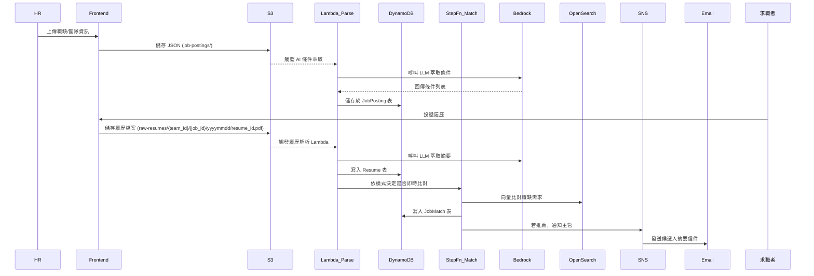

# 📊 Benson-hAIre 智能招募系統資料架構

## 🎯 系統資料流程圖

🪣 S3 Bucket 規劃

| Bucket 名稱 | 用途說明 | 建議 prefix 結構 |
|------------|----------|------------------|
| benson-haire-raw-resume | 儲存履歷原始檔| yyyymmdd/{job_id}-{resume_id}.pdf |
| benson-haire-parsed-resume | 履歷解析後的結構化 JSON | yyyymmdd/{job_id}-{resume_id}.json |
| benson-haire-job-posting | HR 上傳的職缺與團隊 JSON 資料 | job-postings/{team_id}/{job_id}.json |
| benson-haire-static-site | 靜態網站前端頁面（若有 UI） | index.html, assets/, js/ 等 |

## 🧱 資料表 Schema

---

## parsed_resume （解析後履歷）

primary key`resume_id`（string）

| 欄位階層 | 欄位名稱 | 資料型別 | 說明 |
|----------|----------|-----------|------|
| 1 | `resume_id` | string | 履歷唯一識別碼 |
| 1 | `profile` | object | 履歷內容主體 |
| 2 | `profile.basics` | object | 基本資料 |
| 3 | `first_name` / `last_name` | string | 姓名 |
| 3 | `gender` | string | male / female / other / unknown |
| 3 | `emails` | array<string> | 聯絡信箱列表 |
| 3 | `urls` | array<string> | 社群 / 作品連結 |
| 3 | `date_of_birth` | object | 出生年月日 |
| 4 | `year` / `month` / `day` | integer | 年/月/日 |
| 3 | `age` | integer | 年齡 |
| 3 | `total_experience_in_years` | integer | 總工作年資 |
| 3 | `current_title` | string | 現職職稱 |
| 3 | `skills` | array<string> | 技能關鍵字 |
| 2 | `educations` | array<object> | 教育背景 |
| 3 | `start_year` / `end_year` | integer | 年度 |
| 3 | `is_current` | boolean | 是否就讀中 |
| 3 | `issuing_organization` | string | 學校／機構名稱 |
| 3 | `study_type` / `department` | string | 學位類型／科系 |
| 3 | `description` | string | 補充敘述 |
| 2 | `trainings_and_certifications` | array<object> | 訓練與證照 |
| 3 | `year` / `issuing_organization` / `description` | string | 發證年份／機構／說明 |
| 2 | `professional_experiences` | array<object> | 工作經歷 |
| 3 | `start_year` / `end_year` | integer | 年度 |
| 3 | `start_month` / `end_month` | integer | 月份 |
| 3 | `is_current` | boolean | 是否在職 |
| 3 | `duration_in_months` | integer | 總時長 |
| 3 | `company` / `title` / `location` | string | 公司名稱／職稱／地點 |
| 3 | `description` | string | 工作內容 |
| 2 | `awards` | array<object> | 獲獎紀錄 |
| 3 | `year` / `title` / `description` | string | 年份／獎項／說明 |

---

## job_psosting 表（原始職缺）

primary key：`job_id`（string）

| 欄位名稱 | 資料型別 | 說明 |
|----------|-----------|------|
| `job_id` | string | 職缺 UUID |
| `company_name` | string | 公司名稱 |
| `team_id` | string | 單位／部門 |
| `job_title` | string | 職缺名稱 |
| `employment_type` | string | 聘用類型（全職、兼職等） |
| `location` | string | 工作地點 |
| `salary_min` | number | 最低薪資 |
| `salary_note` | string | 薪資說明 |
| `responsibilities` | array<string> | 工作內容 |
| `domains` | array<string> | 技術／業務領域 |
| `required_skills` | array<string> | 必備技能 |
| `nice_to_have_skills` | array<string> | 加分技能 |
| `min_experience_years` | number | 最低年資 |
| `industry_experience` | string | 業界經驗需求 |
| `education_required` | string | 學歷要求 |
| `majors_required` | array<string> | 主修條件 |
| `language_required` | array<string> | 語言條件 |
| `culture_traits` | array<string> | 團隊文化特質 |
| `post_date` | string | 發佈日期（ISO 8601） |

---

## job_requirement（LLM 萃取後職缺敘述）

primary key：`job_id`（string）

| 欄位名稱 | 資料型別 | 說明 |
|----------|-----------|------|
| `job_id` | string | 職缺 ID |\
| `requirement_text` | array<string> | LLM 組合出的人才需求敘述 |
| `generated_at` | string | 萃取時間（ISO 8601） |

## match_result（比對結果）

primary key：`job_id`（string）

| 欄位名稱 | 資料型別 | 說明 |
|----------|-----------|------|
| `job_id` | string | JOB#<job_id> |
| `resume_id` | string | RESUME#<resume_id> |
| `match_score` | number | 匹配分數（0-1） |
| `is_matched` | boolean | 是否匹配 |
| `cot_reason` | string | LLM 評分理由 |
| `matched_at` | string | 比對時間（ISO 8601） |
| `matched_requirements` | array<string> | 符合的需求項目列表 |
| `unmatched_requirements` | array<string> | 不符合的需求項目列表 |