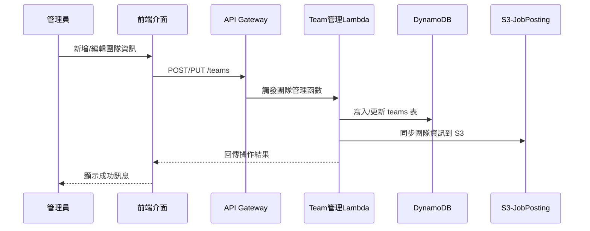
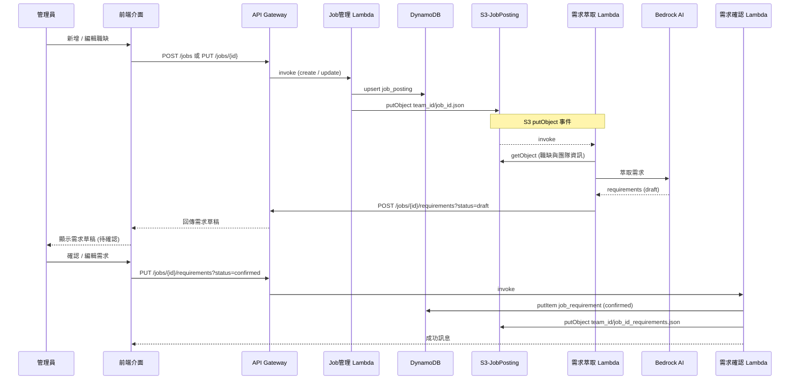
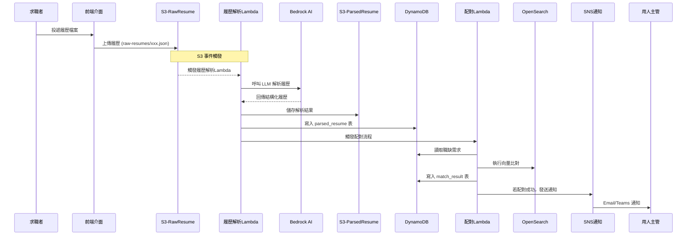

# hAIre dataflow

## 🎯 系統資料流程總覽

本系統包含三個主要資料流程：
1. **團隊資訊管理流程**
2. **職缺資訊管理流程**  
3. **履歷處理與配對流程**

---

## 🏢 **1. 團隊資訊管理流程**



---

## 💼 **2. 職缺資訊管理流程**



---

## 📄 **3. 履歷處理與配對流程**



---

## 🪣 **S3 Bucket 規劃**

| Bucket 名稱 | 用途說明 | 路徑結構 | 備註 |
|------------|----------|----------|----------|
| benson-haire-raw-resume | 儲存履歷原始檔案 | `raw-resumes/{yyyymmdd}/{job_id}-{resume_id}.json` | 以 job_id 與 resume_id 組成檔案名稱 |
| benson-haire-parsed-resume | 履歷解析後的結構化 JSON | `parsed-resumes/{yyyymmdd}/{job_id}-{resume_id}.json` | 以 job_id 與 resume_id 組成檔案名稱 |
| benson-haire-job-posting | 職缺與團隊 JSON 資料 | `teams/{team_id}.json`<br>`jobs/{team_id}/{job_id}.json` |  |
| benson-haire-job-requirement | 職缺需求 JSON 資料 | `job-requirements/{job_id}.json` | |
| benson-haire-static-site | 靜態網站前端頁面 | `index.html`, `assets/`, `js/` 等 | |

---

## 🗃️ **資料表 Schema**

### **teams 表（團隊資訊）**

**Primary Key**: `team_id` (string)

| 欄位名稱 | 資料型別 | 說明 | 範例 |
|----------|----------|------|------|
| `team_id` | string | 團隊唯一識別碼（自動生成：公司代碼-部門代碼-科別代碼-時間戳） | `CXI-DATAAI-CI-06011425` |
| `company` | string | 公司名稱 | `國泰產險` |
| `company_code` | string | 公司代碼（2-8個英數字） | `CXI` |
| `department` | string | 部門名稱 | `數據暨人工智慧發展部` |
| `dept_code` | string | 部門代碼（2-10個英數字） | `DATAAI` |
| `team_name` | string | 團隊/科別名稱 | `企業智能科` |
| `team_code` | string | 科別代碼（2-8個英數字） | `CI` |
| `team_description` | string | 團隊描述 | `負責企業智能化專案開發與維運` |
| `created_at` | string | 建立時間 (ISO 8601) | `2024-01-15T10:00:00Z` |
| `updated_at` | string | 更新時間 (ISO 8601) | `2024-01-15T10:00:00Z` |

---

### **job_posting 表（職缺資訊）**

**Primary Key**: `job_id` (string) - 格式: `{team_id}-{uuid}`

| 欄位名稱 | 資料型別 | 說明 | 範例 |
|----------|----------|------|------|
| `job_id` | string | 職缺 ID | `cxi-dataai-ci-a1b2c3d4` |
| `team_id` | string | 團隊 ID | `cxi-dataai-ci` |
| `job_title` | string | 職缺名稱 | `資深資料科學家` |
| `employment_type` | string | 聘用類型 | `全職` |
| `location` | string | 工作地點 | `台北市` |
| `salary_min` | number | 最低薪資 | `800000` |
| `salary_max` | number | 最高薪資 | `1200000` |
| `salary_note` | string | 薪資說明 | `年薪，含年終獎金` |
| `responsibilities` | array<string> | 工作內容 | `["開發ML模型", "資料分析"]` |
| `required_skills` | array<string> | 必備技能 | `["Python", "SQL", "Machine Learning"]` |
| `nice_to_have_skills` | array<string> | 加分技能 | `["AWS", "Docker", "Kubernetes"]` |
| `min_experience_years` | number | 最低年資 | `3` |
| `education_required` | string | 學歷要求 | `碩士以上` |
| `majors_required` | array<string> | 主修條件 | `["資工", "資管", "統計"]` |
| `language_required` | array<string> | 語言條件 | `["中文", "英文"]` |
| `status` | string | 職缺狀態 | `active/paused/closed` |
| `created_at` | string | 建立時間 (ISO 8601) | `2024-01-15T10:00:00Z` |
| `updated_at` | string | 更新時間 (ISO 8601) | `2024-01-15T10:00:00Z` |

---

### **parsed_resume 表（解析後履歷）**

**Primary Key**: `resume_id` (string)

| 欄位階層 | 欄位名稱 | 資料型別 | 說明 |
|----------|----------|-----------|------|
| 1 | `resume_id` | string | 履歷唯一識別碼 |
| 1 | `has_applied` | boolean | 是否曾經投遞過 |
| 1 | `profile` | object | 履歷內容主體 |
| 2 | `profile.basics` | object | 基本資料 |
| 3 | `first_name` / `last_name` | string | 姓名 |
| 3 | `gender` | string | male / female / other / unknown |
| 3 | `emails` | array<string> | 聯絡信箱列表 |
| 3 | `urls` | array<string> | 社群 / 作品連結 |
| 3 | `date_of_birth` | object | 出生年月日 |
| 4 | `year` / `month` / `day` | integer | 年/月/日 |
| 3 | `age` | integer | 年齡 |
| 3 | `total_experience_in_years` | integer | 總工作年資 |
| 3 | `current_title` | string | 現職職稱 |
| 3 | `skills` | array<string> | 技能關鍵字 |
| 2 | `educations` | array<object> | 教育背景 |
| 3 | `start_year` / `end_year` | integer | 年度 |
| 3 | `is_current` | boolean | 是否就讀中 |
| 3 | `issuing_organization` | string | 學校／機構名稱 |
| 3 | `study_type` / `department` | string | 學位類型／科系 |
| 3 | `description` | string | 補充敘述 |
| 2 | `trainings_and_certifications` | array<object> | 訓練與證照 |
| 3 | `year` / `issuing_organization` / `description` | string | 發證年份／機構／說明 |
| 2 | `professional_experiences` | array<object> | 工作經歷 |
| 3 | `start_year` / `end_year` | integer | 年度 |
| 3 | `start_month` / `end_month` | integer | 月份 |
| 3 | `is_current` | boolean | 是否在職 |
| 3 | `duration_in_months` | integer | 總時長 |
| 3 | `company` / `title` / `location` | string | 公司名稱／職稱／地點 |
| 3 | `description` | string | 工作內容 |
| 2 | `awards` | array<object> | 獲獎紀錄 |
| 3 | `year` / `title` / `description` | string | 年份／獎項／說明 |

---

### **job_requirement 表（LLM 萃取後職缺需求）**

**Primary Key**: `job_id` (string)

| 欄位名稱 | 資料型別 | 說明 |
|----------|-----------|------|
| `job_id` | string | 職缺 ID |
| `requirement_text` | array<string> | LLM 組合出的人才需求敘述 |
| `is_confirmed` | boolean | 使用者是否已確認需求 |
| `generated_at` | string | 萃取時間（ISO 8601） |
| `confirmed_at` | string | 確認時間（ISO 8601） |
| `version` | number | 版本號 |

---

### **match_result 表（履歷配對結果）**

**Primary Key**: `job_id` (string), **Sort Key**: `resume_id` (string)

| 欄位名稱 | 資料型別 | 說明 |
|----------|-----------|------|
| `job_id` | string | 職缺 ID |
| `resume_id` | string | 履歷 ID |
| `match_score` | number | 匹配分數（0-1） |
| `is_matched` | boolean | 是否符合配對條件 |
| `cot_reason` | string | LLM 評分理由 |
| `matched_at` | string | 比對時間（ISO 8601） |
| `matched_requirements` | array<string> | 符合的需求項目列表 |
| `unmatched_requirements` | array<string> | 不符合的需求項目列表 |

---

<!-- ## 🔐 **權限管理與 Cognito 整合**

### **第一階段：Admin Only**
- 使用 Cognito User Pool 建立管理員帳號
- 前端使用 Cognito Hosted UI 進行登入
- Lambda 函數驗證 JWT token

### **Cognito 整合流程**：
```mermaid
sequenceDiagram
    participant User as 管理員
    participant Frontend as 前端
    participant Cognito as Cognito
    participant API as API Gateway
    participant Lambda as Lambda

    User->>Frontend: 點擊登入
    Frontend->>Cognito: 重導向到 Hosted UI
    Cognito->>User: 顯示登入表單
    User->>Cognito: 輸入帳密
    Cognito->>Frontend: 回傳 JWT Token
    Frontend->>API: 請求時帶入 Authorization Header
    API->>Cognito: 驗證 JWT Token
    API->>Lambda: Token 有效，執行函數
``` -->
